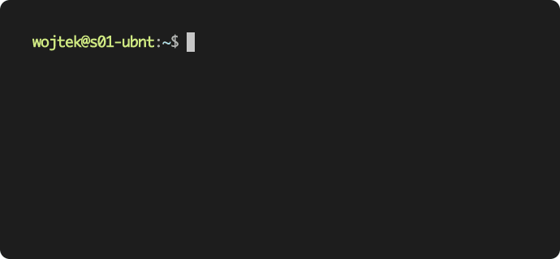

<span align="center">



<h3>DynHost</h3>
<p>The simplest tool for fetching and saving the external IP address in the DNS record of your own domain. It supports the OVH and Cloudflare.</p>
</span>

---
<span align="center">

[](https://github.com/Wojteek/dynhost/)
[](https://hub.docker.com/r/wojteek/dynhost)
[](https://hub.docker.com/r/wojteek/dynhost)
[](https://hub.docker.com/r/wojteek/dynhost)
[](https://github.com/Wojteek/dynhost/)

</span>

- [Motivation](#motivation)
- [Use case](#use-case)
- [How to use it?](#how-to-use-it)
  - [Docker (recommended)](#docker-recommended)
    - [docker-compose.yml](#docker-composeyml)
  - [Building from the source](#building-from-the-source)
- [Global options](#global-options)
- [List of all commands](#list-of-all-commands)
    - [`cloudflare [command options] [arguments...]` - Cloudflare provider](#cloudflare-command-options-arguments---cloudflare-provider)
    - [`ovh [command options] [arguments...]` - OVH provider](#ovh-command-options-arguments---ovh-provider)
- [Auto start](#auto-start)

## Motivation

This code was created in Golang for a few reasons. I've needed some tool for updating an external IP in OVH (that option is called DynHost in the management panel). Why? First of all, my Internet service provider doesn't guarantee that the IP address wouldn't change.

## Use case

I've wanted to create a OpenVPN service on my Raspberry PI. As I've written above my ISP doesn't guarantee the permanent IP address. In that case I needed some tool for updating the DynHost in OVH to use my dedicated domain name instead of using the dynamic IP address for connecting.

## How to use it?

```bash
./bin/dynhost [global options] command [command options] [arguments...]
```

### Docker (recommended)

To run this application as Docker image you can use:

```bash
docker run -v $(pwd)/data.json:/app/data.json wojteek/dynhost:latest --help
```

Each version of this tool is tagged by version of release so instead of using `latest` tag you can use a specific version.

#### docker-compose.yml

```
version: "3"
services:
  dynhost:
    image: wojteek/dynhost:latest
    command: [
      "--timer=15m",
      "cloudflare",
      "--auth-token=YOUR_AUTH_TOKEN",
      "--zone-id=YOUR_ZONE_ID",
      "--dns-id=YOUR_DNS_ID",
      "--hostname=dynhost.example.com",
    ]
    container_name: "dynhost"
    restart: always
    volumes:
      - ./data.json:/app/data.json:rw
```

### Building from the source

In order to build this tool you can just run:

```bash
make build-app
```

## Global options

```
--data value    Set the path of the JSON file with the data of an application (default: "data.json")
--timer value   Set the interval between automatic checking of an external IP address (default: 0s)
--debug         Enable the debug mode (default: false)
--help, -h      Show help (default: false)
--version, -v   Print the version (default: false)
```

## List of all commands

#### `cloudflare [command options] [arguments...]` - Cloudflare provider

*Note: Don't use the Global API Key at Cloudflare. This tool supports the API Token, that's why I recommend you to [create a new one](https://dash.cloudflare.com/profile/api-tokens) (`Zone.DNS` with `Edit` permission - as additional step you can specific zone)*

**Options**
```
--auth-token value  The authentication token of the Cloudflare API [$CLOUDFLARE_AUTH_TOKEN]
--zone-id value     The zone identifier (Cloudflare DNS) [$CLOUDFLARE_ZONE_ID]
--dns-id value      The dns identifier (Cloudflare DNS) [$CLOUDFLARE_DNS_ID]
--hostname value    The hostname (Cloudflare DNS) [$CLOUDFLARE_HOSTNAME]
```
 
#### `ovh [command options] [arguments...]` - OVH provider

Visit [the documentation](https://docs.ovh.com/gb/en/domains/hosting_dynhost/) if you don't have the credentials of the DynHost option.

**Options**
```
--auth-username value  The authentication username of the DynHost option [$OVH_AUTH_USERNAME]
--auth-password value  The authentication password of the DynHost option [$OVH_AUTH_PASSWORD]
--hostname value       The hostname of the DynHost option [$OVH_HOSTNAME]
```

## Auto start

If you would like to add this tool to the service manager (for example for auto-starting), I recommend you to use `systemd`. Bellow there is a sample configuration which is used by me. You just have to adjust this configuration to yourself.

```
[Unit]
Description="DynHost"

[Service]
User=YOUR_USER
ExecStart=/path/to/dynhost [global options] command [command options] [arguments...]
Restart=always
RestartSec=10s
KillMode=process
TimeoutSec=infinity

[Install]
WantedBy=multi-user.target
```

In my case (Raspbian) the configuration is located in: `/lib/systemd/system/dynhost.service`
